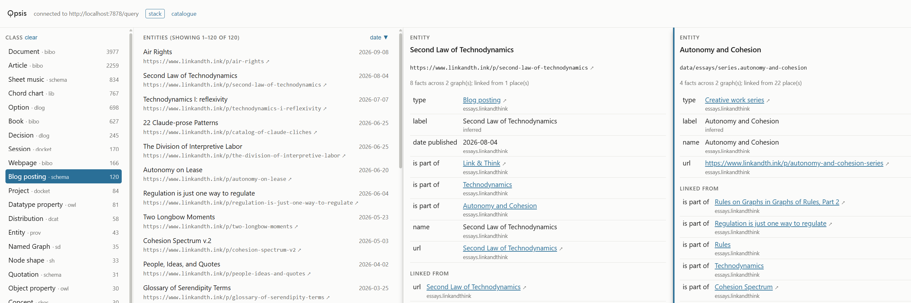

# Opsis

One-file faceted browser for RDF graphs. 

Open `index.html`, give it the SPARQL endpoint, and start browsing the graph behind.

Every click is a SPARQL query. 

The name comes from ὄψις, "view, aspect". 

The current version of Opsis is meant for personal knowledge graphs (It is too slow for public graphs the size of DBpedia or Wikidata).

```
index.html?endpoint=http://localhost:7878/query
```

<picture>
  <source media="(prefers-color-scheme: dark)" srcset="assets/screenshot-pkg-dark.png">
  
</picture>

Here is also a [live demo](https://kvistgaard.github.io/opsis/?endpoint=https://data.nobelprize.org/store/sparql) on the Nobel Prize linked data.
## One file, all SPARQL

Opsis is under 1.5K lines of HTML, CSS, and JavaScript. It has no build step, no libraries, and no server. The page sends SPARQL queries directly to the endpoint in response to user actions.

Selecting a class adds `?s a/rdfs:subClassOf* <class>` to the query. Selecting a graph adds `GRAPH <graph> { ?s ?p ?o }`. 

Opsis maintains no index or cache. The results reflect the current contents of the store.

### Stacked panes

There are three panes by default: one for classes and graphs, the next one on the right for their entities and then for the tripes of a selected entity. When you press **stack** in the header, then a click on link open a pane on the right. If there is one already on the right, it's replaced. If none is opened on the right, a new one is opened and so you an get multiple panes opened at the same time.

The address bar keeps the open panes, so you can bookmark a stack or send it to
someone.

## Settings

Opsis reads its settings from the graph it browses. Edit [`settings.example.ttl`](settings.example.ttl) there like any other RDF data.

Three features use settings:

- Opening local files in desktop applications, for example Markdown notes in
  Obsidian
- Choosing between several SPARQL endpoints from the header
- Pinning classes. The classes you list in the settings appear at the top of the Class list for everyone who opens the graph. A class you pin with a click (the pin icon appears when you hover on a class) stays pinned only in your own browser but if so you wish, you can copy it as Turtle with one click and add to the settings. 


## Troubleshooting

| symptom | cause |
|---|---|
| `endpoint error: …` in the header | the endpoint is not running, or does not allow cross-origin requests (CORS) |
| no entities, though the store has data | the endpoint's default graph is not the union of its named graphs |
| everything shows as a bare IRI | the store has no `rdfs:label` values |
| every query is slow to start | the endpoint listens on IPv4 only, and `localhost` resolves to `::1` first |
| an application link does nothing | no application is registered for its address, such as `obsidian://` |

## Roadmap

- Pane search
- Larger graphs, with counts precomputed or estimated.
- Back and forward through stacked panes with the browser's history.
- Keyboard navigation between panes.

## Licence

MIT. See [LICENSE](LICENSE) and [CHANGELOG.md](CHANGELOG.md).
